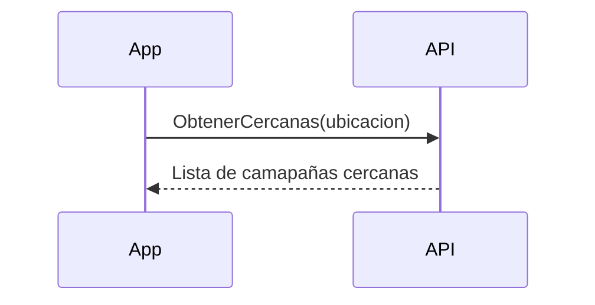

---
{"dg-publish":true,"permalink":"/proyecto/home-de-la-aplicacion/","updated":"2023-10-08T11:57:35.590-06:00"}
---

## Definición

La pantalla de inicio es de acceso público, incluso un usuario no registrado debería poder verla, ya que solo se trata de ver las [[Programa de lealtad\|campañas de lealtad]] que cumplan con las reglas para poder verse en esta sección principal.

<iframe style="border:none" width="800" height="450" src="https://whimsical.com/embed/4DXF7ycZqEJkb9UWXnjQPy@7YNFXnKbZAG5gTjjBMefC"></iframe>

De igual manera, en esta pantalla el usuario podrá ver el menú de acceso principal a las demás funciones destacadas como son, [[Mi perfil\|Mi perfil]], [[Registrar consumo\|Registrar consumo]], [[Proyecto/Mi negocio\|Mi negocio]]

### [[Más cercanas\|Más cercanas]]

Esta sección mostrará las campañas más cercanas a la ubicación del usuario, se mostrarán solo las primeras 5 en el home.
Al seleccionar "ver más" en esa misma sección, el usuario podrá ver todas las posibles comenzando por las más cercanas.

<iframe style="border:none" width="800" height="450" src="https://whimsical.com/embed/4DXF7ycZqEJkb9UWXnjQPy@7YNFXnKbZAGLY5AAMwnCo"></iframe>

### [[Destacadas\|Destacadas]]

### [[Recién agregadas\|Recién agregadas]]

## Técnico

